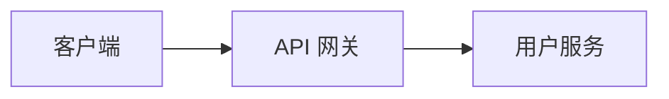

# 质量红线（quality-bar）

撰写全程遵守本节。图、代码、论证、清单、措辞五块。

## Mermaid 图规范（写图前必读）

### 何时用图

| 场景 | 图类型 |
|------|--------|
| 架构/拓扑/调用链概览 | `flowchart TB`（或 BT/LR/RL） |
| 时序/交互 | `sequenceDiagram` |
| 数据模型/ER | `erDiagram` |
| 类/领域关系 | `classDiagram` |
| 状态与流转 | `stateDiagram-v2` |

图能说清才放；放图必须能渲染通过。

### 语法方向（最重要的一条）

Mermaid 语法是 `节点ID[展示文本]`——**方括号里是展示文本，等号/定义左边才是 ID**：



规则：

- ID 用**语义化英文**（`client`、`apiGateway`、`orderDB`）；禁止无意义字母（`A`、`B`、`C`）、禁止中文 ID。
- 展示文本用中文可读，**一律用双引号包裹**（含空格/中文标点时不加引号会解析出错）。
- 首次出现时完整定义 `id["展示"]`，后续引用只写 `id`（如 `client --> orderDB`），不要重复整段定义。
- **不要**用旧式反向写法 `客户端[client]`——它把中文当 ID、英文当展示文本，方向与规则相反，渲染语义颠倒且部分预览器异常。生成前若参考旧示例，一律按本节改写。

### 校验

成稿后（若本机能定位到本 skill 目录）跑：

```bash
node <本skill目录>/scripts/check-mermaid.mjs <生成文件>
```

- 全部 `OK` → 通过；`[MERMAID-ERROR]` → **必须修复后重跑，不静默放过**；`[MERMAID-WARN]`（`<br>` 规范提示）为提示级，可忽略或顺手修正。
- 脚本复用 `project-insight` 的校验引擎（同一套 mermaid + jsdom 解析），本 skill 的 `scripts/check-mermaid.mjs` 是薄壳。依赖缺失时会给出明确提示（需 `skills/project-insight/scripts/` 已 `npm install`）。

## 代码片段原则

默认**不含代码**，仅在以下情况添加：

- 用户明确要求示例；
- 需要展示新架构模式的典型写法；
- API 方案需要接口定义/请求响应示例；
- 核心算法需伪代码说明。

格式：标准 Markdown 代码块 + 语言标注 + 简洁中文注释；示例代表性优先，不过度冗长。

## 论证充分性

- **技术选型**：2-3 种方案对比，说清各方案的代价与回退路径，不罗列、不带偏见。
- **架构设计**：说明设计原则；每一条关键取舍可追溯到原则或约束。
- **风险应对**：具体可执行（责任人/动作/触发条件），含降级与回滚预案，而不是「加强监控」这类空话。
- **实施计划**：给明确时间节点或区间，并注明假设（人力、依赖、排期变化时的调整方式）。

## 评审检查清单（单一真源）

**唯一清单来源在本节。** 模板（尤其完整档）不再内嵌清单；收尾时按下表档位取子集，再叠加 `types.md` 对应类型的特有项，可生成在文末「评审检查清单」小节，也可口头收口。

| 档位 | 取用方式 |
|------|----------|
| 轻量 | 每类取最关键 1-2 条，合计 5-8 条 |
| 标准 | 每类 2-3 条 |
| 完整 | 全量 + 类型特有项 |

- **架构合理性**：设计是否符合业务规模（不过度设计）；模块划分清晰；系统边界明确；无单点故障或已说明容错。
- **性能评估**：是否符合量化性能目标；缓存/索引策略是否覆盖读写路径；是否存在未解释的瓶颈假设。
- **安全性**：认证授权机制；数据加密方案；接口权限控制；敏感数据保护与审计合规点。
- **可维护性**：结构清晰；监控/日志/链路方案是否到位（完整档）；文档是否能让接手人独立读懂。
- **风险控制**：主要风险已识别；应对措施可行（含具体动作）；有降级与回滚方案。

## 语言与可读性

- 全文**简体中文**；技术术语保留英文（API、RPC、Kafka），首现给中文释义。
- 语义式标题层级；章节按篇幅控制在合理长度；重要结论用加粗或列表强调。
- 论证充分但克制：每节回答「为什么」而非堆砌；非技术人员也能读懂核心思路。
